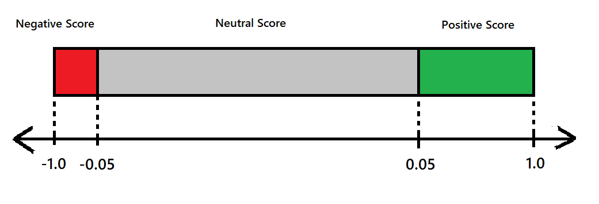

# Sentify

Sentify is a website that runs on top of the Sentiment analyzer library to analyze YouTube comments. 
 
## Announcement
The code base is currently under development, but you can preview the website [here](https://zhengjiawen.pythonanywhere.com/).

This drawing is crude, but this is how you can interpret compound scores that you get as the result:

</img>
